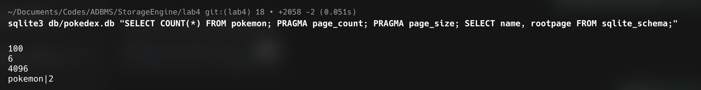
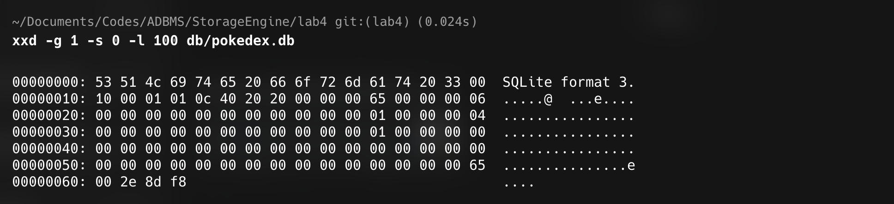
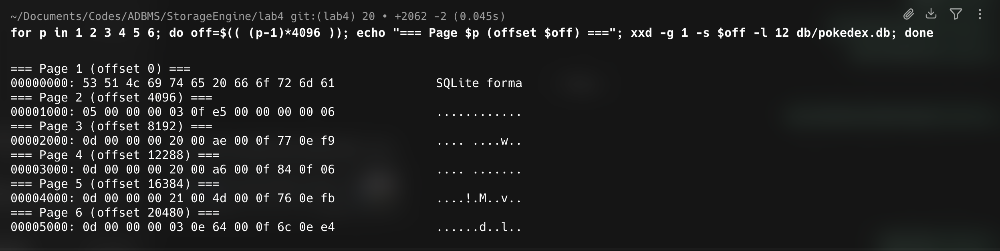
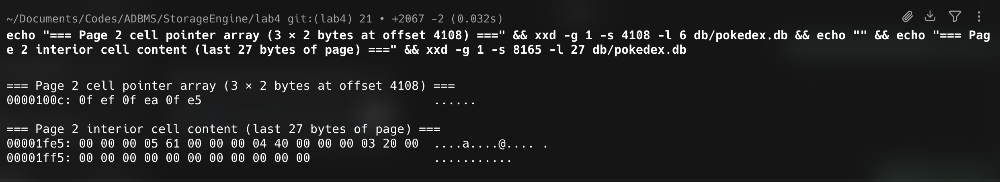
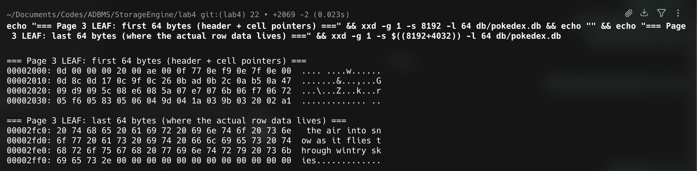
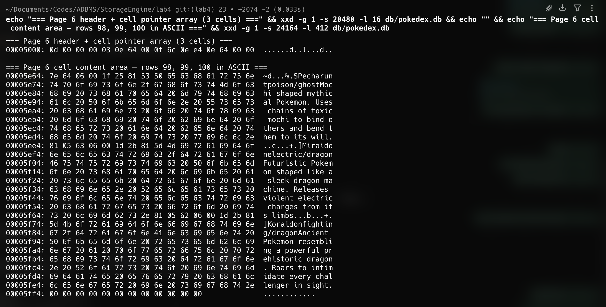

# Lab 4 — Navigating SQLite Pages and B-Tree Nodes

## 1. Goal
Take a real SQLite database, hex-dump it with `xxd`, and walk through every layer:
file header → pages → B-tree nodes → cells → records. The DB used here
(`db/pokedex.db`) holds **100 legendary/mythical/UB Pokemon** in a single
table with the schema:

```sql
CREATE TABLE pokemon (
    id          INTEGER PRIMARY KEY,
    name        TEXT,
    type        TEXT,
    description TEXT
);
```

Page size is **4096 bytes**. The DB ends up using **6 pages**, which forces
SQLite to build a B-tree with one interior node and four leaf nodes — exactly
what we need to see the tree structure.



---

## 2. Whole file layout

A SQLite database file is just N fixed-size pages laid end-to-end. Page
numbers start at 1.

```
offset  0          4096        8192       12288      16384      20480      24576
        │           │           │          │          │          │          │
        ├──Page 1───┼──Page 2───┼──Page 3──┼──Page 4──┼──Page 5──┼──Page 6──┤
        │ file hdr  │ pokemon   │  leaf    │  leaf    │  leaf    │  leaf    │
        │ + schema  │ INTERIOR  │ rowids   │ rowids   │ rowids   │ rowids   │
        │ b-tree    │ (root)    │ 1..32    │ 33..64   │ 65..97   │ 98..100  │
        └───────────┴───────────┴──────────┴──────────┴──────────┴──────────┘
```

The first **100 bytes** of page 1 hold the **file header**. Every other
page starts directly with a B-tree page header.

---

## 3. The file header (bytes 0–99)

Dump: `hexdumps/01_file_header.hex`

```
00000000: 53 51 4c 69 74 65 20 66 6f 72 6d 61 74 20 33 00  SQLite format 3.
00000010: 10 00 01 01 00 40 20 20 ...
```



| Offset | Length | Field                         | Value in our DB    |
|--------|--------|-------------------------------|--------------------|
| 0      | 16 B   | Magic header string           | `"SQLite format 3\0"` |
| 16     | 2 B    | Page size                     | `0x1000 = 4096`    |
| 18     | 1 B    | File format write version     | 1                  |
| 19     | 1 B    | File format read version      | 1                  |
| 20     | 1 B    | Reserved bytes at end of page | 0                  |
| 21     | 1 B    | Max embedded payload fraction | 64                 |
| 24     | 4 B    | File change counter           |                    |
| 28     | 4 B    | In-header database page count | 6                  |
| 44     | 4 B    | Schema cookie                 |                    |
| 56     | 4 B    | Text encoding (1 = UTF-8)     | 1                  |
| 96     | 4 B    | SQLite version number         |                    |

---

## 4. B-tree page header

Every page (interior or leaf) begins with a B-tree page header. Leaves use
**8 bytes**; interior pages use **12 bytes** (the extra 4 bytes hold the
right-child pointer).

| Offset | Size | Field                       |
|--------|------|-----------------------------|
| 0      | 1 B  | Page type                   |
| 1      | 2 B  | First freeblock offset      |
| 3      | 2 B  | Number of cells (N)         |
| 5      | 2 B  | Start-of-cell-content area  |
| 7      | 1 B  | Number of fragmented bytes  |
| 8      | 4 B  | Right-child page #          |

Page-type byte values:

| Hex   | Meaning                |
|-------|------------------------|
| 0x02  | Index interior page    |
| 0x05  | Table interior page    |
| 0x0A  | Index leaf page        |
| 0x0D  | Table leaf page        |

For **page 1** the B-tree header starts at offset **100** (after the file
header). For every other page it starts at offset **0** of that page.

---

## 5. Real page-by-page walk

The single most useful diagnostic — first 12 bytes of every page reveals the
type byte, cell count, and right-child pointer of each node in one screen:



### Page 1 — `sqlite_schema`

After the 100-byte file header, page 1 holds the schema B-tree (the master
table that lists every user table and its root page). Querying it:

```
$ sqlite3 db/pokedex.db "SELECT name, rootpage FROM sqlite_schema;"
pokemon|2
```

So when SQLite wants to query the `pokemon` table it jumps to **page 2**.

### Page 2 — Interior node of the `pokemon` B-tree

Header dump (`hexdumps/03_page2_interior_header.hex`):

```
00001000: 05 00 00 00 03 0f e5 00 00 00 00 06
```

Decoded:

| Byte(s)             | Value                  | Meaning                        |
|---------------------|------------------------|--------------------------------|
| `05`                | 0x05                   | Table interior page            |
| `00 00`             | 0                      | No freeblocks                  |
| `00 03`             | 3                      | 3 cells                        |
| `0f e5`             | 4069                   | Cell content starts at offset 4069 within the page |
| `00`                | 0                      | 0 fragmented bytes             |
| `00 00 00 06`       | 6                      | **Right-child page = 6**       |

Cell pointer array (`hexdumps/04_page2_cell_pointers.hex`), 3 entries × 2 B:

```
0000100c: 0f ef 0f ea 0f e5
```

| Cell index | Pointer (page offset) | File offset |
|------------|-----------------------|-------------|
| 0 (lowest key)  | 0x0fef = 4079 | 8175 |
| 1               | 0x0fea = 4074 | 8170 |
| 2 (highest key) | 0x0fe5 = 4069 | 8165 |

Interior cell content (`hexdumps/05_page2_interior_cells.hex`):

```
00001fe5: 00 00 00 05 61   00 00 00 04 40   00 00 00 03 20  ...
```

Each interior cell = 4-byte left-child page + 1-byte rowid varint:

| Cell | Left child page | Key (rowid) | Meaning                |
|------|-----------------|-------------|------------------------|
| 0    | 3               | 32          | rowids ≤ 32 → page 3   |
| 1    | 4               | 64          | rowids 33–64 → page 4  |
| 2    | 5               | 97          | rowids 65–97 → page 5  |
| —    | 6 (right-child) | —           | rowids > 97 → page 6   |



### Pages 3–6 — Leaf nodes

Each leaf page header (first 8 bytes):

| Page | First bytes               | Decoded                  |
|------|---------------------------|--------------------------|
| 3    | `0d 00 00 00 20 00 ae 00` | leaf, 32 cells, content @ 0x00ae |
| 4    | `0d 00 00 00 20 00 a6 00` | leaf, 32 cells, content @ 0x00a6 |
| 5    | `0d 00 00 00 21 00 4d 00` | leaf, 33 cells, content @ 0x004d |
| 6    | `0d 00 00 00 03 0e 64 00` | leaf, 3 cells, content @ 0x0e64  |

32 + 32 + 33 + 3 = **100 rows** ✓

A peek inside page 3 — the 8-byte leaf header, the cell-pointer array growing
forward, and (at the bottom of the page) the actual ASCII text of the rows:



---

And the rightmost leaf — the page that Page 2's right-child pointer (`6`)
lands on. Only 3 cells fit (ids 98, 99, 100) so the entire content area is
visible at once, with the pokemon names readable directly in ASCII:



## 6. The whole B-tree, drawn

```
                   ┌─────────────────────────────────────┐
                   │      PAGE 2  (Interior, type 0x05)  │
                   │                                     │
                   │  Cell[0]: child=3, key=32           │
                   │  Cell[1]: child=4, key=64           │
                   │  Cell[2]: child=5, key=97           │
                   │  RightChild = 6                     │
                   └──┬────────┬────────┬────────┬──────┘
                      │        │        │        │
              ┌───────┘   ┌────┘    ┌───┘   └────────────┐
              ▼           ▼         ▼                    ▼
         ┌────────┐  ┌────────┐ ┌────────┐         ┌────────┐
         │ Page 3 │  │ Page 4 │ │ Page 5 │         │ Page 6 │
         │ LEAF   │  │ LEAF   │ │ LEAF   │         │ LEAF   │
         │ 0x0D   │  │ 0x0D   │ │ 0x0D   │         │ 0x0D   │
         │ 32 row │  │ 32 row │ │ 33 row │         │ 3 row  │
         │ id 1–32│  │id 33–64│ │id 65–97│         │id 98–100│
         └────────┘  └────────┘ └────────┘         └────────┘
```

---

## 7. Inside one page — header / pointers / cells

Every B-tree page has the same physical layout. **Header grows down from
offset 0, cells grow up from offset 4095.** The unallocated space in the
middle is free space — when it shrinks to zero, the page splits.

```
offset 0                                                            offset 4095
│                                                                       │
├───────────────────────────────────────────────────────────────────────┤
│ Page    │ Cell pointer  │                              │  Cell content │
│ header  │ array         │   ← unallocated / free →     │  (grows back  │
│ 8 or 12 │ N × 2 bytes   │                              │   towards     │
│ bytes   │               │                              │   middle)     │
└─────────┴───────────────┴──────────────────────────────┴───────────────┘
```

In our **page 2** (interior, 3 cells), the layout works out to:

* bytes 0..11 — page header
* bytes 12..17 — cell pointer array (`0f ef 0f ea 0f e5`)
* bytes 18..4068 — unallocated (4051 free bytes)
* bytes 4069..4095 — three 5-byte interior cells (rest is padding)

---

## 8. Inside one cell

### Leaf cell (table B-tree)

```
┌──────────────┬──────────────┬─────────────────────────────────────────┐
│ payload size │ rowid varint │   record header  +  record body         │
│ varint       │ varint       │                                         │
└──────────────┴──────────────┴─────────────────────────────────────────┘
```

The record itself is a header followed by a body:

```
┌──────────────────────┬────────────────────────────┐
│ record header        │ record body                │
│   header-length      │   value of column 0        │
│   serial type col 0  │   value of column 1        │
│   serial type col 1  │   value of column 2        │
│   serial type col 2  │   value of column 3        │
│   serial type col 3  │                            │
└──────────────────────┴────────────────────────────┘
```

For `(id INTEGER PRIMARY KEY, name TEXT, type TEXT, description TEXT)`
the `id` column is an alias of the rowid and is stored as `serial_type = 0`
(NULL) in the body — the real value lives in the rowid varint already in
the cell header.

Serial type rules used here:

| Serial type   | Meaning                                |
|---------------|----------------------------------------|
| 0             | NULL (rowid alias)                     |
| N ≥ 13, odd   | TEXT of length `(N - 13) / 2` bytes    |

### Interior cell (table B-tree)

```
┌────────────────────┬─────────────┐
│ left child         │ rowid       │
│ page number        │ varint      │
│ 4 bytes (big-end)  │             │
└────────────────────┴─────────────┘
```

Interior cells are tiny (5 bytes each in this DB), so a single interior
page can fan out to hundreds of children — that's why B-trees stay shallow.

---

## 9. Lookup walkthrough — `SELECT * FROM pokemon WHERE id = 42`

1. Open the file, read **page 1**, scan `sqlite_schema` → find pokemon's
   `rootpage = 2`.
2. Read **page 2**. Type byte is `0x05` → interior. Walk cell-pointer
   array in key order:

   * Cell[0] key = 32 → 42 > 32, keep going.
   * Cell[1] key = 64 → 42 ≤ 64, descend to **child page 4**.

3. Read **page 4**. Type byte `0x0D` → leaf. Binary-search the cell
   pointer array for rowid 42. Read its payload, decode the record header,
   then read `name`, `type`, `description` from the body.

Total: **3 page reads** for 100 rows.

---

## 10. All B-tree pointers and structure (summary table)

| Page | Type     | Hex | # Cells | Pointer field(s)                                        |
|------|----------|-----|---------|---------------------------------------------------------|
| 1    | sqlite_schema leaf | 0x0D | 1 | (root of schema btree)                              |
| 2    | table interior     | 0x05 | 3 | left-children: 3, 4, 5  •  right-child: 6           |
| 3    | table leaf         | 0x0D | 32| 32 cells, no child pointers                         |
| 4    | table leaf         | 0x0D | 32| 32 cells, no child pointers                         |
| 5    | table leaf         | 0x0D | 33| 33 cells, no child pointers                         |
| 6    | table leaf         | 0x0D | 3 | 3 cells, no child pointers                          |

---

## 11. Files in this lab

```
lab4/
├── README.md                                     ← this file
├── seed.sql                                      ← schema + 100 INSERTs
├── db/
│   └── pokedex.db                                ← real SQLite DB
├── hexdumps/
│   ├── pokedex_full.hex                          ← full xxd dump
│   ├── 01_file_header.hex                        ← bytes 0..99
│   ├── 02_page1_btree_header.hex                 ← page 1 b-tree hdr
│   ├── 03_page2_interior_header.hex              ← interior node hdr
│   ├── 04_page2_cell_pointers.hex                ← interior cell ptrs
│   ├── 05_page2_interior_cells.hex               ← interior cell content
│   ├── 06_page3_leaf_start.hex                   ← leaf page 3 hdr
│   ├── 07_page4_leaf_start.hex                   ← leaf page 4 hdr
│   ├── 08_page5_leaf_start.hex                   ← leaf page 5 hdr
│   └── 09_page6_leaf_start.hex                   ← leaf page 6 hdr
└── screenshots/
    ├── 01_db_shape.png                           ← terminal proof of DB shape
    ├── 02_file_header.png                        ← magic string + page size
    ├── 03_page_tour.png                          ← first 12 B of every page
    ├── 04_interior_wiring.png                    ← interior cells decoded
    ├── 05_leaf_page3.png                         ← inside a leaf page
    └── 06_rightmost_leaf.png                     ← right-child target
```

---

## 12. Reproducing this lab end to end

```bash
cd StorageEngine/lab4

# (1) Build the DB
rm -f db/pokedex.db
mkdir -p db hexdumps
sqlite3 db/pokedex.db < seed.sql

# (2) Sanity check
sqlite3 db/pokedex.db "SELECT COUNT(*) FROM pokemon;
                        PRAGMA page_count;
                        PRAGMA page_size;
                        SELECT name, rootpage FROM sqlite_schema;"

# (3) Hex dumps
xxd -g 1                db/pokedex.db > hexdumps/pokedex_full.hex
xxd -g 1 -s 0     -l 100 db/pokedex.db > hexdumps/01_file_header.hex
xxd -g 1 -s 100   -l 8   db/pokedex.db > hexdumps/02_page1_btree_header.hex
xxd -g 1 -s 4096  -l 12  db/pokedex.db > hexdumps/03_page2_interior_header.hex
xxd -g 1 -s 4108  -l 6   db/pokedex.db > hexdumps/04_page2_cell_pointers.hex
xxd -g 1 -s 8165  -l 16  db/pokedex.db > hexdumps/05_page2_interior_cells.hex
xxd -g 1 -s 8192  -l 64  db/pokedex.db > hexdumps/06_page3_leaf_start.hex
xxd -g 1 -s 12288 -l 64  db/pokedex.db > hexdumps/07_page4_leaf_start.hex
xxd -g 1 -s 16384 -l 64  db/pokedex.db > hexdumps/08_page5_leaf_start.hex
xxd -g 1 -s 20480 -l 64  db/pokedex.db > hexdumps/09_page6_leaf_start.hex

# (4) Inspect every page's first 12 bytes
for p in 1 2 3 4 5 6; do
    off=$(( (p-1)*4096 ))
    echo "=== Page $p (file offset $off) ==="
    xxd -g 1 -s $off -l 12 db/pokedex.db
done
```

---

## 13. References

* SQLite Database File Format — https://www.sqlite.org/fileformat.html
* `xxd(1)` man page
* Alex Petrov, *Database Internals* — chapter on B-trees and slotted pages
